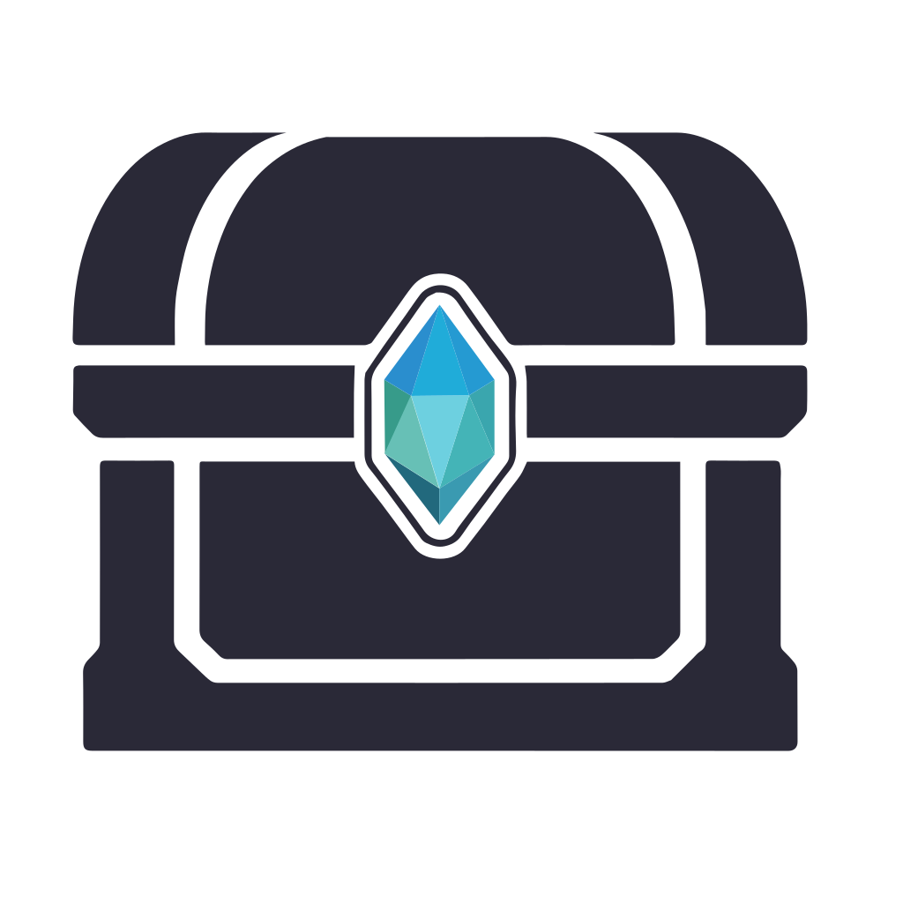
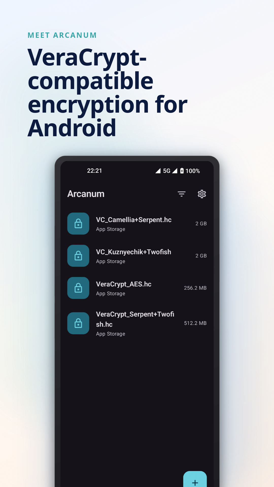
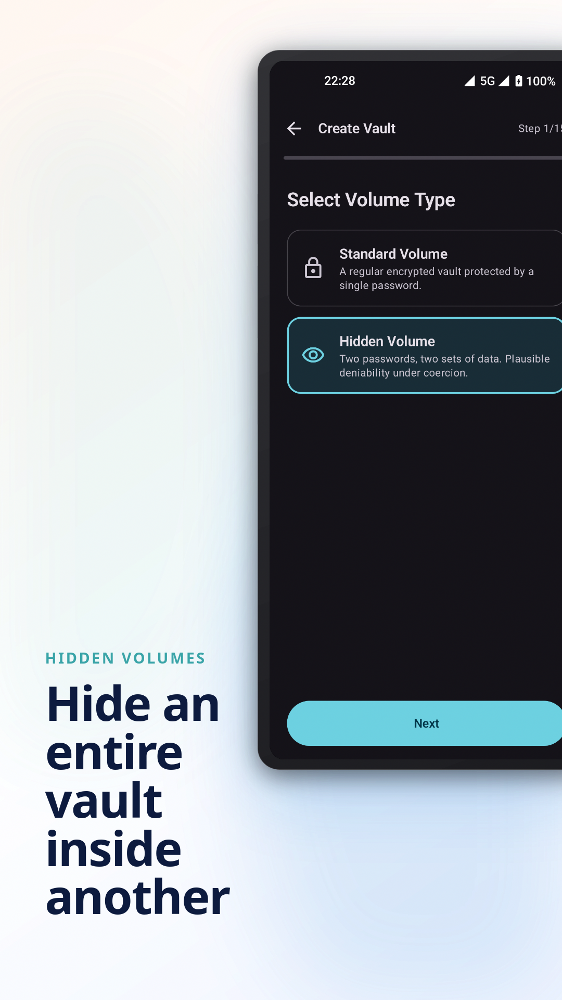
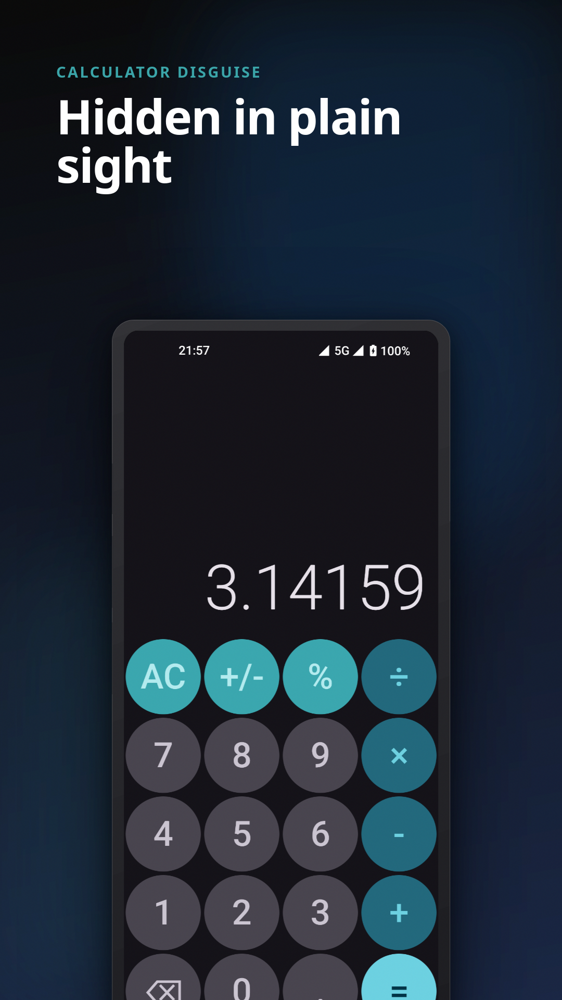
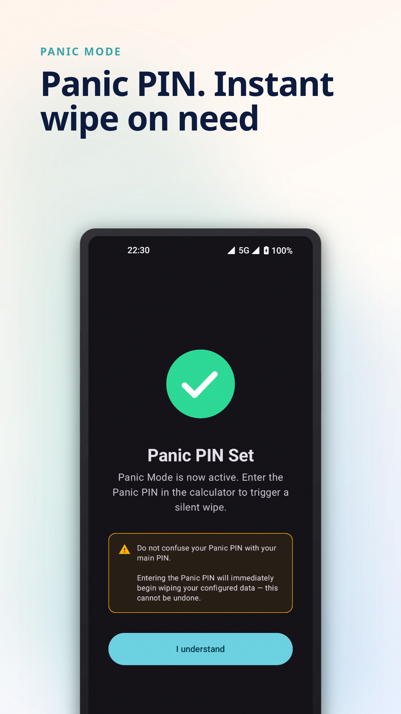
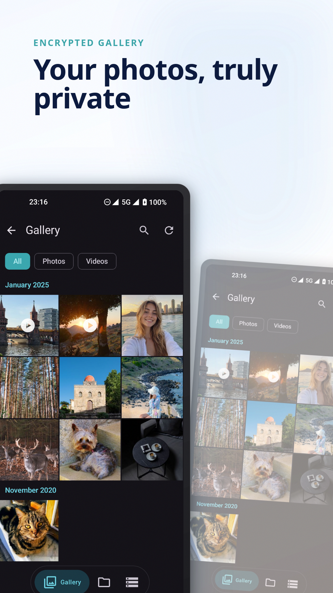
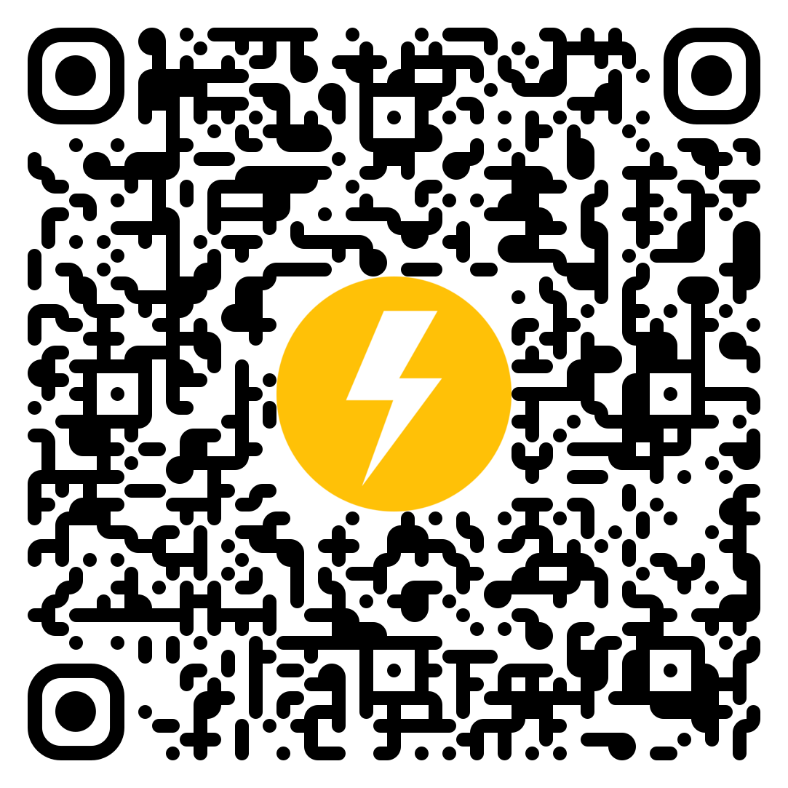
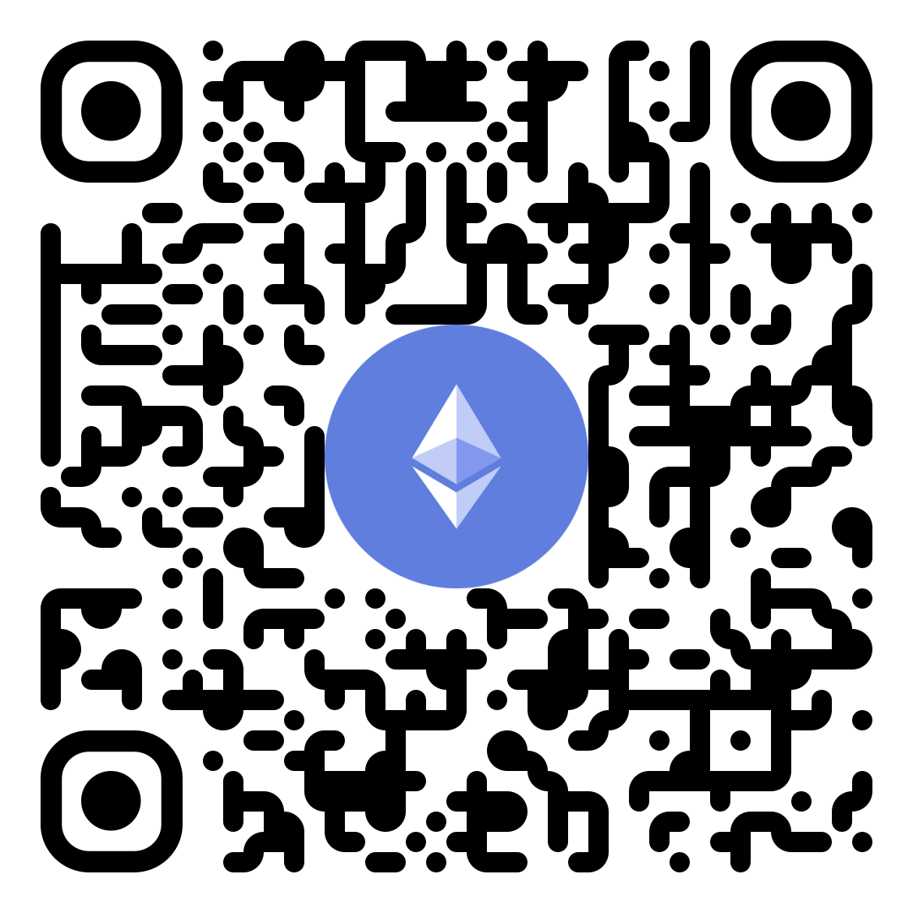
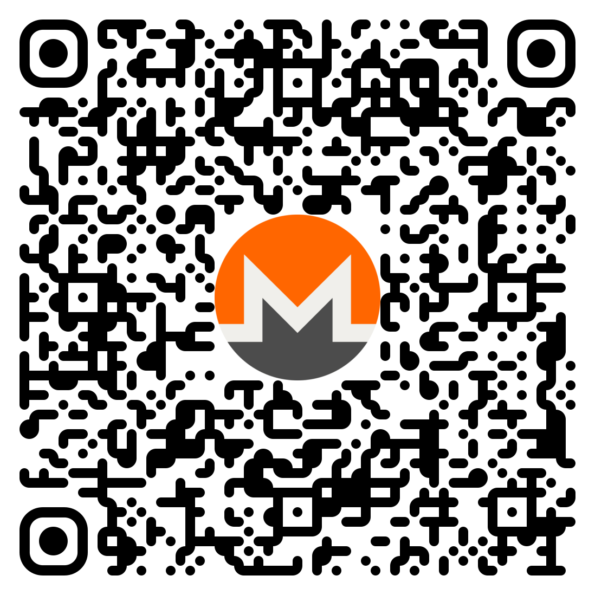
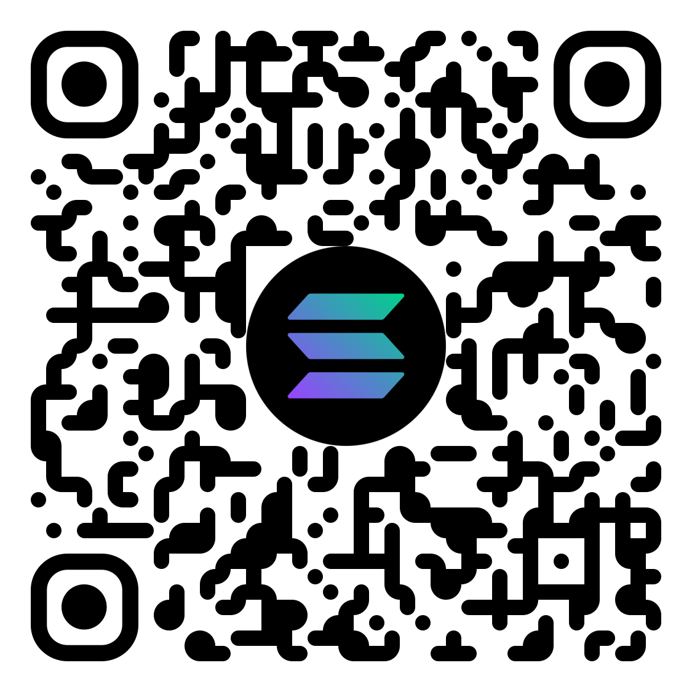

<p align="center">
  
</p>

<h1 align="center">Arcanum</h1>

<p align="center">
  VeraCrypt-compatible encrypted vault manager for Android
</p>

<p align="center">
  <a href="https://www.apache.org/licenses/LICENSE-2.0">
    
  </a>
  
  
  
</p>

<!-- TODO: add F-Droid badge once published -->

<p align="center">
  <a href="https://arcanum.zip">Website</a> ·
  <a href="https://arcanum.zip/docs">Docs</a> ·
  <a href="https://arcanum.zip/privacy">Privacy Policy</a>
</p>

---

## Screenshots

<p align="center">
  
  
  
  
  
</p>

---

## Features

**Cryptography**
- 🔐 Full VeraCrypt container compatibility — open containers created on desktop (Windows, macOS, Linux)
- 🔒 15 cipher configurations: AES, Serpent, Twofish, Camellia, Kuznyechik and all cascade combinations
- #️⃣ PBKDF2 PRFs plus Argon2id KDF support: SHA-512, SHA-256, Whirlpool, Streebog, BLAKE2s-256, Argon2id
- 🗝️ Keyfile support with pool-based derivation matching VeraCrypt's implementation
- 🔢 PIM (Personal Iterations Multiplier) support

**Privacy**
- 🫥 Hidden volumes for plausible deniability
- 🧮 Disguise profiles — calculator, system, flashlight, timer, stopwatch, and other launcher identities
- 🚨 Panic password — instantly triggers configurable wipe (containers, files, app data)
- 🔏 Auto-lock with configurable delay
- 🕵️ Intruder capture — optional front-camera photo after failed unlock attempts
- 🌐 Zero telemetry — network access is used only for optional manual backups to S3-compatible storage or MEGA

**Vault access**
- 👆 Biometric unlock per vault (hardware-backed key binding)
- 🗝️ Biometric credentials remember PIM, cipher/hash choices, and keyfile URIs
- 🔑 App password can be a numeric PIN or a 4-128 character password
- ⏱️ Per-vault auto-unmount on screen lock or background

**In-vault browsing**
- 🖼️ Encrypted gallery with image and video viewer, HEIF decoding, and M4V indexing
- 🎵 Audio player with waveform and dominant-color theming
- 📂 Full file manager (create, rename, delete, move, import, export, share, and cross-vault copy/move)
- 📝 Built-in text editor for UTF-8 text files
- 📷 Camera capture directly into a mounted vault

**Vault maintenance**
- 💾 Manual backups of the encrypted container file to a local folder, S3-compatible storage, or MEGA
- 🧾 VeraCrypt volume header backup and restore from embedded or external header backups
- 📈 Safe volume expansion by rebuilding a larger VeraCrypt container and migrating files
- 🧹 Optional deletion of original files after successful import/export

**UI**
- 🎨 AMOLED Glass theme — frosted-glass system bars and dialogs on pure black
- 🌙 Dynamic Color (Material You) support
- 📱 Edge-to-edge, Android 10+
- 🌍 English and Russian app locales

---

## Why Arcanum

Arcanum is built directly on VeraCrypt's cryptographic C sources — the same AES, XTS, PBKDF2, Argon2id, and cascade cipher implementations used in the desktop application. Containers created in Arcanum open in VeraCrypt on desktop and vice versa, with no conversion or export needed.

The app password is protected with Argon2id (t=2, m=64 MB, p=1) rather than a simple hash. A panic password and disguise profiles are included as first-class features, not afterthoughts. Calculator mode unlocks by entering the password and holding `=` for about seven seconds; other disguise profiles open the real unlock screen by holding the fake screen title.

Manual backup copies the encrypted container file as-is. Vault contents are not decrypted during backup, and backup destination credentials are stored in EncryptedSharedPreferences. Network permission is therefore present only for optional S3-compatible and MEGA backup destinations; the app does not include telemetry.

Volume header backup is separate from full-container backup. Arcanum can save the encrypted VeraCrypt volume header to an external file and restore the primary header from either the embedded backup area or an external header backup.

Volume expansion uses a safe rebuild workflow: Arcanum creates a larger temporary VeraCrypt container, copies the file tree, verifies the migrated data, and then replaces the original. Hidden volumes are preserved only when the hidden credentials are supplied.

---

## Installation

<p>
  <a href="https://f-droid.org/en/packages/zip.arcanum/"></a>
  <a href="https://github.com/Esdex/Arcanum/releases/latest"></a>
</p>

<!-- TODO: add Google Play badge once published -->

### Build from source

```bash
git clone https://github.com/Esdex/Arcanum.git
cd Arcanum
./gradlew assembleFdroidRelease
```

**Requirements:**
- Android Studio (with JBR — set `org.gradle.java.home` in `~/.gradle/gradle.properties`)
- Android NDK r28+
- CMake 3.22.1+
- Min SDK 29 / Target SDK 36

The `fdroid` flavor builds with all features unlocked and no billing dependency. The `playstore` flavor includes Google Play Billing for the freemium tier.

---

## Architecture

| Layer | Technology |
|---|---|
| UI | Kotlin + Jetpack Compose (Material 3) |
| Navigation | Navigation Compose, single-Activity |
| Crypto core | C++/NDK — VeraCrypt's cipher sources via JNI bridge |
| File system | FatFs (FAT32/exFAT inside containers) |
| Local storage | Room (container metadata), EncryptedSharedPreferences (PIN hashes) |
| DI | Hilt |
| Media | ExoPlayer / Media3 |
| Backup | Foreground service for local folder, S3-compatible, and MEGA encrypted-container backups; native volume header backup/restore |
| Network | No telemetry; `INTERNET` is used only for optional manual S3/MEGA backup |

The app can present itself as a calculator or another utility profile. Entering the correct app password navigates to the authenticated vault home. A panic password triggers `PanicManager`, which executes a background wipe before navigation completes, equalizing the response time between both paths.

For a deeper dive, see the [architecture section in the docs](https://arcanum.zip/docs).

### Permissions

| Permission | Used for |
|---|---|
| `INTERNET` | Optional manual backup to S3-compatible storage or MEGA |
| `CAMERA` | Optional intruder capture and flashlight disguise mode |
| Foreground data sync service | Long-running container creation, expansion, and backup operations |

MEGA uploads may use MEGA storage hostnames that require a scoped cleartext exception for `userstorage.mega.co.nz` and `userstorage.mega.nz`. This exception is limited to those domains.

---

## Security

The codebase has been reviewed using AI-assisted security analysis across multiple passes. Reports are published in [`/audits`](audits/).

**Reporting a vulnerability:** Please use [GitHub Security Advisories](https://github.com/Esdex/Arcanum/security/advisories/new) to report security issues privately. Do not open a public issue for vulnerabilities.

---

## Contributing

Contributions are welcome for bug fixes and non-cryptographic improvements (UI, translations, documentation, gallery/file manager features). For changes touching the crypto layer, JNI bridge, PIN/panic logic, or any other security-critical path, please open an issue first to discuss the approach.

- Run `./gradlew lint` before submitting
- Native code changes must build cleanly for both `arm64-v8a` and `armeabi-v7a`
- The `fdroid` flavor must remain free of any Google Play Services dependency

---

## Support

If Arcanum is useful to you, you can support its development:

<p>
  <a href="https://github.com/sponsors/Esdex">
    
  </a>
  &nbsp;
  <a href="https://ko-fi.com/Esdex">
    
  </a>
</p>

### Crypto

**Bitcoin**


```
bc1qk3pjpxfzafpc56924m8hnyewcgmutchwrg4v2p
```

---

**Bitcoin Lightning**



```
esdex@cake.cash
```

---

**Ethereum**



```
0xDc4B00d937e4a9633d37d70dDF56E8370f44E0f8
```

---

**Monero**



```
83xHcG9NNzLhsYQ9QoMcX2EFCwEPT1rSSa4EPgDMG3PqQEXVZ1vgaTtAq9x4zETjkRRK7CiH6giHshTLUJHTD4mCRBbt42s
```

---

**Solana / USDT / USDC**



```
GJgu5VqmEfxfQQbRpp9CDcYUxjsjUPJpHsCfyjRQGGSX
```

## License

```
Copyright 2026 Esdex

Licensed under the Apache License, Version 2.0 (the "License");
you may not use this file except in compliance with the License.
You may obtain a copy of the License at

    https://www.apache.org/licenses/LICENSE-2.0
```

The cryptographic core (`app/src/main/cpp/veracrypt/`) incorporates source code from [VeraCrypt](https://veracrypt.fr), also licensed under Apache 2.0.

---

## Acknowledgments

- **[VeraCrypt](https://veracrypt.fr)** — AES, Serpent, Twofish, Camellia, Kuznyechik, SHA-2, Whirlpool, Streebog, BLAKE2s, XTS mode implementation
- **[FatFs](http://elm-chan.org/fsw/ff/)** — FAT32/exFAT file system layer for in-container access
- **[ExoPlayer / Media3](https://developer.android.com/media/media3)** — media playback inside encrypted containers
- **[Haze](https://github.com/chrisbanes/haze)** — frosted-glass UI effects
- **[BouncyCastle](https://www.bouncycastle.org)** — Argon2id PIN key derivation
- **[AboutLibraries](https://github.com/mikepenz/AboutLibraries)** — open-source license screen
